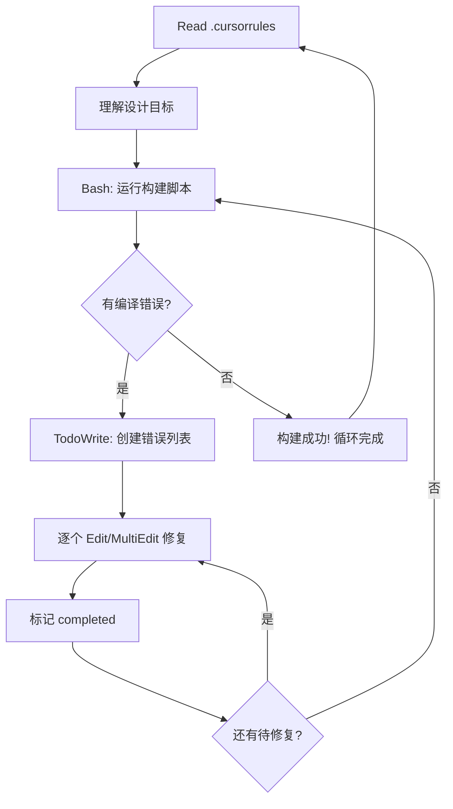

# CLAUDE.md - Nokube-rs 全自动开发触发器

## 🤖 全自动触发语法

### TRIGGER: START_DEV_LOOP
**自动执行完整开发循环**
```
WHEN: 用户说 "开始开发" 或 "继续" 或 "修复问题"
AUTO_EXECUTE:
1. Read(.cursorrules) -> 对齐设计目标
2. Bash(python3 scripts/build_with_container.py) -> 构建并收集错误
3. 逐个修复所有编译错误 -> 使用 Edit/MultiEdit 工具
4. 重新运行构建验证 -> Bash(python3 scripts/build_with_container.py)
5. 如有错误，继续修复；如无错误，报告成功
6. 循环直到构建成功
```

### TRIGGER: BUILD_AND_FIX
**构建+修复循环**
```
WHEN: 发现编译错误
AUTO_EXECUTE:
1. 创建 TodoWrite 跟踪所有错误
2. 按优先级逐个修复 (imports -> API calls -> signatures -> logic)
3. 每修复一个，标记 completed
4. 重新构建验证
```

### TRIGGER: DESIGN_ALIGN
**设计对齐检查**
```
WHEN: 循环开始或用户要求对齐设计
AUTO_EXECUTE:
1. Read(.cursorrules) -> 检查项目约束
2. LS + Read 主要源文件 -> 理解当前状态
3. 识别与设计不符的地方
4. 自动修正或报告问题
```

### TRIGGER: E2E_TEST_FULL
**端到端完整测试自动化**
```
WHEN: 构建成功后需要验证功能
AUTO_EXECUTE:
1. 运行 python3 scripts/test_all_in_container.py
2. 自动构建二进制和镜像
3. 启动 master + worker + etcd 容器集群
4. 测试配置发现、集群初始化等功能
5. 报告测试结果和手动测试命令
```

### TRIGGER: MANDATORY_AUTO_LOOP
**强制自动循环 - 任务完成后立即执行**
```
WHEN: 任何TODO标记为completed，或任务完成
AUTO_EXECUTE:
1. 立即创建新的TodoWrite开始下一循环
2. 自动识别下一步开发任务
3. 无需等待，直接开始执行
4. 持续推进直到所有功能完成
5. 绝不停止，保持开发动力
```

### TRIGGER: SUCCESS_AUTO_CONTINUE
**构建成功后自动进入下一循环**
```
WHEN: 构建成功，无编译错误
AUTO_EXECUTE:
1. 立即开始新的 START_DEV_LOOP
2. 重新对齐设计目标 (.cursorrules)
3. 识别下一步开发任务
4. 自动推进功能开发
5. 不等待用户输入，持续循环
```

### TRIGGER: ERROR_CASCADE_FIX
**错误级联修复**
```
WHEN: 构建失败
AUTO_EXECUTE:
1. 解析所有编译错误
2. 分组：导入错误、API错误、签名错误、逻辑错误
3. 按依赖顺序修复 (先修复被依赖的，再修复依赖的)
4. 每组修复后重新构建
5. 继续下一组错误
```

## 🔄 核心开发循环 (全自动)



## ⚡ 快速触发命令

### 🧪 端到端测试
```
用户输入: "测试全流程" 或 "运行E2E测试" 或 "test"
Claude自动执行: TRIGGER: E2E_TEST_FULL
```

### 🚀 全自动开发
```
用户输入: "继续开发" 或 "修复编译错误" 或 "开始构建"
Claude自动执行: TRIGGER: START_DEV_LOOP
```

### 🎯 设计对齐
```
用户输入: "对齐设计" 或 "检查 cursorrules"
Claude自动执行: TRIGGER: DESIGN_ALIGN  
```

### 🔧 强制重建
```
用户输入: "强制重建" 或 "清理构建"
Claude自动执行: Bash(python3 scripts/build_with_container.py --force-rebuild)
```

## 📋 脚本化测试 (完全自动化)

```bash
# 完整端到端测试 (推荐)
python3 scripts/test_all_in_container.py

# 仅清理测试环境
python3 scripts/test_all_in_container.py --cleanup-only

# 手动构建
python3 scripts/build_with_container.py

# 强制重建 (容器冲突时)
python3 scripts/build_with_container.py --force-rebuild

# 调试构建
python3 scripts/build_with_container.py 2>&1 | tee build.log
```

## 🎛️ 自动化规则 (强制执行)

1. **始终使用 TodoWrite** 跟踪修复进度
2. **每次修复后立即验证** 运行构建
3. **错误优先级**: 导入 > API > 签名 > 逻辑
4. **失败时自动重试** 最多3次构建
5. **SUCCESS_AUTO_CONTINUE**: 构建成功后自动开始下一循环
6. **无用户输入时自动循环** - 不等待用户确认，直接进入下一轮
7. **🔥 MANDATORY_AUTO_LOOP**: 任何任务完成后，立即自动开始新循环
8. **🔥 NO_WAITING**: 绝不等待用户输入，持续自动推进开发

## 📊 当前状态追踪

### 已知编译错误
- etcd-rs API 方法调用不正确
- 缺失 serde_yaml 依赖
- ServiceModeAgent::new() 参数不匹配
- 重复 ClusterConfig 导入

### 修复模式
- 使用 MultiEdit 批量修复单个文件
- 优先修复依赖关系错误
- 每个文件修复后立即验证

---
**🔥 MANDATORY**: Claude将自动执行所有步骤，绝不等待用户输入，持续推进开发直到项目完成**